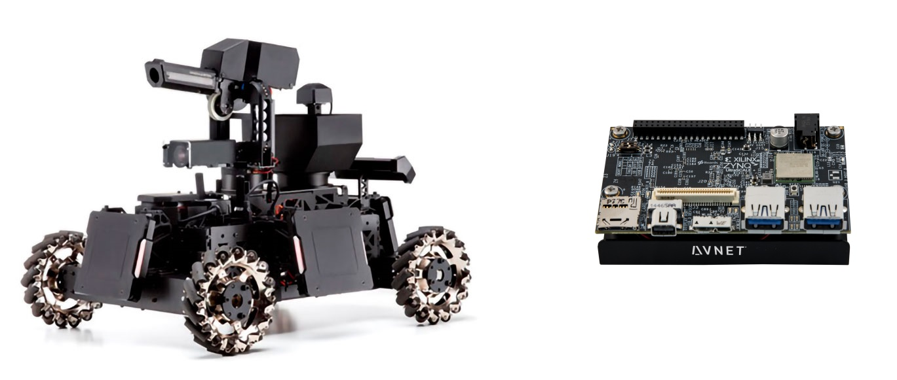
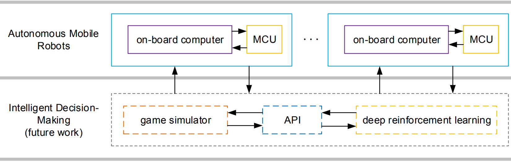

# RoboRTS-Ultra96
This project is based on [RoboRTS](https://github.com/RoboMaster/RoboRTS), an open source software stack for Real-Time Strategy reasearch on mobile robots, developed by RoboMaster. 

This project is intended to be used with Xilinx Zynq UltraScale+ ™ MPSoC. The current board supported for this release is [AVNET Ultra96](https://www.96boards.org/product/ultra96/). 

## Introduction

### RoboRTS Software Stack

RoboRTS is an open source software stack for Real-Time Strategy research on mobile robots, developed by RoboMaster and motivated by [RoboMaster AI Challenge](#competition)

The framework of RoboRTS consists two parts: autonomous mobile robot layer and intelligent decision-making layer.

The autonomous mobile robot layer alone can let a robot, offically supported for RoboMaster AI Robot platform, to demonstrate a certain level of intelligence. On its on-board computer(Ultra96) runs perception, motion planning, decision modules. It is fully supported in ROS with community driven as well as platform-customized codes and examples. On its MCU, an RT low-level robot controller is implemented to govern the robot driving system.

### Xilinx Zynq UltraScale+ ™ MPSoC for RoboMaster

## Tutorial

For more information about RoboMaster AI Robot platform and RoboRTS framework, please refer to [RoboRTS Tutorial](https://robomaster.github.io/RoboRTS-Tutorial/#/)

## Competition

RoboMaster holds AI Challenge since 2017. In the challenge, multiple robots should fight with each other on a game field automatically under different rules.

For more information, please refer to

- [DJI RoboMaster 2019 ICRA AI Challenge](https://icra2019.org/competitions/dji-robomaster-ai-challenge)

- [DJI RoboMaster 2018 ICRA AI Challenge](https://icra2018.org/dji-robomaster-ai-challenge/)

## Copyright and License

RoboRTS is provided under the [GPL-v3](COPYING).
